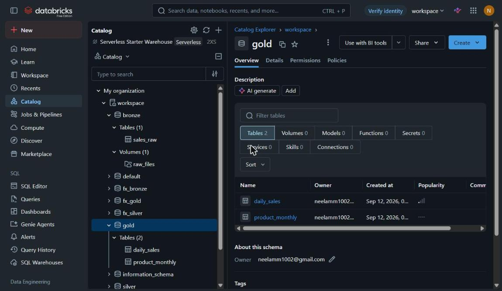

# Retail Sales Pipeline

A data pipeline I built on Databricks Free Edition using about 1 million real
retail transactions. Raw CSV files go in, cleaned tables come out, and the data
gets checked before anything is used for reporting.



## What it does

The data moves through three layers:

- **Bronze** - the raw file, saved as-is. Nothing is cleaned here.
- **Silver** - cleaned and typed. One row per invoice line.
- **Gold** - summary tables. Sales per day, sales per product per month.

The point of keeping three layers is that if I get a cleaning rule wrong, I can
fix it and rebuild silver and gold from bronze. I never have to download the
source file again.

## Row counts from my run

| Stage | Rows |
|-------|------|
| Source file | 1,067,371 |
| Bronze | 1,067,371 |
| Silver | 1,015,451 |
| Dropped | 51,920 |

The 51,920 rows dropped in silver are rows with no product description, a price
of zero, or a duplicate invoice line.

## One thing that caught me out

The source file has a column called `Customer ID`, with a space in it. Delta
tables don't allow spaces in column names, so the write failed. I fixed it by
renaming every column to use underscores in the bronze step. That rename is the
only change bronze makes - no rows dropped, no values changed.

## Cleaning rules in silver

1. Proper column names and data types
2. Invoices starting with `C` are cancellations, so I flag them
3. `line_amount` = quantity x unit price
4. Drop rows with no description or a price of zero
5. Drop duplicate invoice lines

## Quality checks

Five checks run before the gold tables get built. Each one counts bad rows and
should return 0.

| Check | What it looks for |
|-------|-------------------|
| duplicate_lines | Duplicates that survived silver |
| null_stock_code | Missing product codes |
| zero_or_negative_price | Prices that shouldn't exist |
| future_dates | Invoice dates in the future |
| negative_qty_not_flagged | Returns that weren't marked as cancellations |

The first four stop the pipeline if they fail. The fifth only warns, because a
few odd rows there don't make the report wrong.

All five returned 0 on my run. The fifth one returned 0 because silver's
"price must be above zero" filter already removes the adjustment rows that
negative quantities live in.

## Running it

1. Create the schemas and a volume:

```sql
CREATE SCHEMA IF NOT EXISTS workspace.bronze;
CREATE SCHEMA IF NOT EXISTS workspace.silver;
CREATE SCHEMA IF NOT EXISTS workspace.gold;
CREATE VOLUME IF NOT EXISTS workspace.bronze.raw_files;
```

2. Download the dataset, convert both Excel sheets to CSV, upload them to the
   volume.
3. Run the notebooks in order: `01_bronze`, `02_silver`, `03_quality`, `04_gold`.

## Data

[Online Retail II](https://archive.ics.uci.edu/dataset/502/online+retail+ii) -
1,067,371 transactions from a UK online retailer, 2009 to 2011. UCI, CC BY 4.0.

## Built with

PySpark, Delta Lake, SQL, Databricks, Unity Catalog.

## Note

This is a personal project I built to learn, not production work. The notebooks
are run by hand - there is no scheduler on this one. My other project,
currency-rates-datamart, is the one where I added scheduling.
